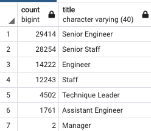
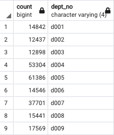

# Pewlett-Hackard-Analysis

## Overview
In this module we utilized SQL to analyze people eligible for retirement Pewlett-Hackard.  We started by grouping the people that would be eligible for retirement based on their age.  We then grouped this data by titles to determine the skill set needed to replace the retiring people.  Finally we took a look at a group of people that could be eligible for the mentorship program

## Results
From our analysis we are able to identify the following key data points:
  - There are 90,398 employees that could possibly retire in the near future
  - Senior Engineers and Senior Staff have the highest number of people in this retirement category, 32.5% and 31.3% respectively
  - There are 1,549 employees that fall into the mentorship eligibility table
  - The pool of mentors come cover each group of titles that are retiring.

  

## Conclusions
Based on this analysis there are only 1,549 employees eligible to move into mentorship roles.  However, there are 90,398 employees eligible for retirement.  In my opinion there is not enough employees in the mentorship roles.  As such I would recommend looking into expanding the code to meet the qulifications to be a mentor. I expanded the range of the birth dates in the code established in Deliverable two to be between 1956 and 1965 `AND (e.birth_date BETWEEN '1956-01-01' AND '1965-12-31')`.  This increased the pool and is more in line with the 90K of employees that may possibly retire.  Especially when you take into consideration that not everyone will accept moving into a part time role and mentoring other people.  Finally, I believe that the company needs to look at their complete demographics.  Total current employee count is at 240,124, which means that over 30% of their workforce is eligible for retirement, that is a large knowledge base to lose.

 
